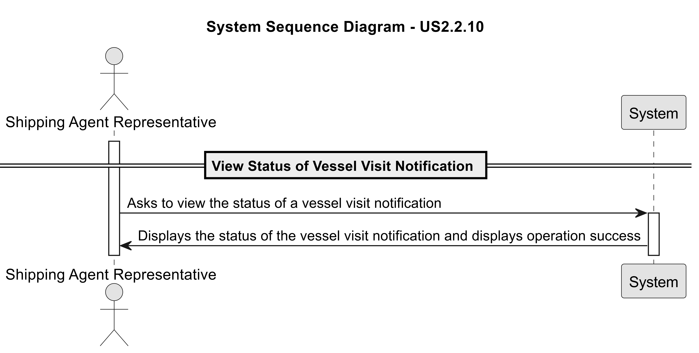

# US 2.2.10

## 1. Context

*The Port Authority reviews the notification and decides to approve or reject it. If the visit is rejected,
a reason must be provided to the agent, such as missing documentation or dock unavailability. If the
visit is approved, a dock is assigned, potentially with support from an intelligent algorithm that
considers pending visits, vessel type, dock capacity, and other operational constraints.*

## 2. Requirements

**US 2.2.10** As a Shipping Agent Representative, I want to view the status of all my submitted Vessel Visit Notifications (in progress, pending, approved with current dock assignment, or rejected with reason), so that I am always informed about the decisions of the Port Authority

**Acceptance Criteria:**

- The Shipping Agent Representative may also view the status of Vessel Visit Notifications submitted by other representatives working for the same shipping agent organization.

- Vessel Visit Notifications must be searchable and filterable by vessel, status, representative and time.

**Dependencies/References:**

*There is a dependency with US2.2.3, since a dock must exist in order for the Port Authority to assign one when approving a Vessel Visit Notification.*
*There is a dependency with US2.2.6, since a shipping agent representative must exist to view the status of all vessel visit notification.*
*There is a dependency with US2.2.8, since a vessel visit notification must exist so the Shipping Agent Representative can view its status.* 

**Forum Insight:**

>> Good Evening,
When a Shipping agent representative wants to check the status of a Vessel Visit Notification from another representative in the same organization, should he have the possibility of choosing from who he wants to see or just be presented to him all the Vessel Visit Notifications of every representative in the same organization?
>
> According to the US acceptance criteria, "Vessel Visit Notifications must be searchable and filterable by vessel, status, representative and time."
So, you may show all (s)he can view and allow filtering by representative.

>>As a Shipping Agent Representative, I want to view the status of all my submitted Vessel Visit Notifications (in progress, pending, approved with current dock assignment, or rejected with reason), so that I am always informed about the decisions of the Port Authority.\
Acceptance Criteria / Comments:\
• The Shipping Agent Representative may also view the status of Vessel Visit Notifications submitted by other representatives working for the same shipping agent organization.\
• Vessel Visit Notifications must be searchable and filterable by vessel, status, representative and time.\
Boa tarde, quando diz que as Vessel Visit Notifications devem ser filtráveis por tempo, o que é exatamente o tempo? Devemos ter uma data de início e uma data de fim ou devemos ter apenas um tempo respetivo à demora da Vessel Visit?
>
>Não é filtrar por tempo mas sim por período, o que implica início e fim.

## 3. Analysis

