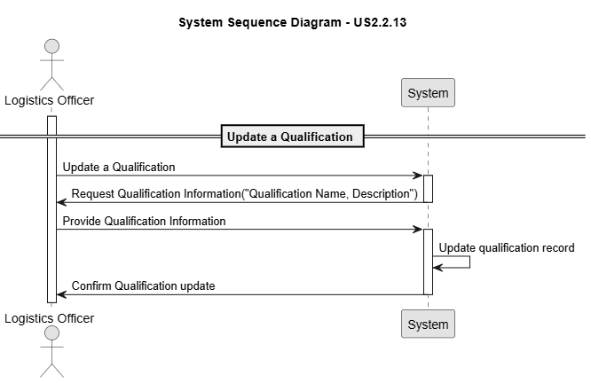
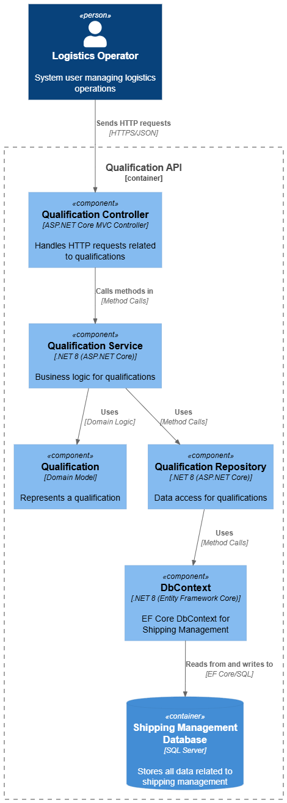
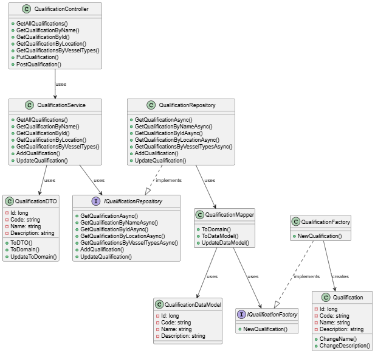
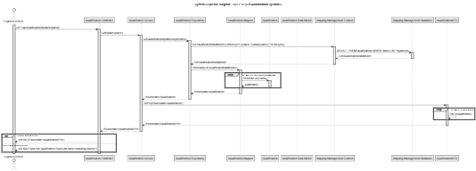
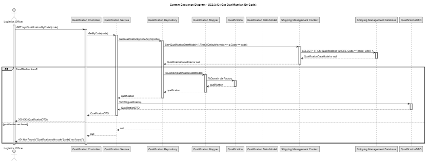

# US 2.2.13

## 1. Context

*Qualification: Each staff member is registered with the qualifications they hold (e.g., STS crane operator, yard gantry cranes operator, truck driver, yard planner). Certain resources may only be operated by staff with matching qualifications (e.g., an STS crane requires a certified STS crane operator).*

## 2. Requirements

**US 2.2.13** As a Logistics Operator, I want to register and manage qualifications (create, update), so that staff members and resources can be consistently associated with the correct skills and certifications required for port operations.

**Acceptance Criteria:**

- Each qualification has a unique code and a descriptive name (e.g., "STS Crane Operator," "Truck Driver").

- Qualifications must be searchable and filterable by code or name.

- A qualification must exist before it can be assigned to staff members or resources.


**Dependencies/References:**

*There is no dependencies associated to this US.*

**Forum Insight:**

>> In relation to the update action for qualifications, a question has arisen: when performing an update, is it possible to change the code, the name, or both?
> 
> Both are updatable.
However, you need to ensure that:
1.The code remains unique;
2.Existing relationships of either resources and/or of staff to qualifications must remain valid.

>>Bom dia cliente, surgiu-nos algumas questões sobre as qualificações:
Staff member deverá ter sempre alguma qualificação ou poderá não ter nenhum? Ou poderá ter mais que uma qualificação?
Um physical resource deverá ter sempre alguma qualificação associada? Por exemplo um carrinho de mão precisaria de alguma qualificação associada?
>
>1.A staff member might have no qualifications at all.
2.A staff member might have several qualifications.
3.A physical resource may require no qualifications to be operated.

## 3. Analysis

Qualification Registration


Qualification Update


## 4. C4 Model

#### Context - Level 1


#### Containers - Level 2


#### Components - Level 3



#### Code - Level 4



#### Level +1

##### Qualification POST


##### Qualification BET ByName


##### Qualification GET ByCode


##### Qualification UPDATE


## 5. Integration Tests

### Tests Related to Post

```csharp
    [Fact]
        public async Task PostQualification_ValidData_ReturnsCreatedAndOK()
        {
            var newQualification = new QualificationDTO
            {
                Code = "QUAL4",
                Name = "Fourth Qualification",
                Description = "Description for fourth qualification test"
            };

            var postResponse = await _client.PostAsJsonAsync("/api/Qualification", newQualification);
            Assert.Equal(HttpStatusCode.Created, postResponse.StatusCode);

            var createdQualification = await postResponse.Content.ReadFromJsonAsync<QualificationDTO>();
            Assert.NotNull(createdQualification);
            Assert.Equal(newQualification.Code, createdQualification.Code);
            Assert.Equal(newQualification.Name, createdQualification.Name);
            Assert.Equal(newQualification.Description, createdQualification.Description);


            var getResponse = await _client.GetAsync($"/api/Qualification/ByCode/{newQualification.Code}");
            Assert.Equal(HttpStatusCode.OK, getResponse.StatusCode);
        }

        [Theory]
        [InlineData("QUAL1", "Duplicate Code Test", "Valid description for duplicate code test")]
        [InlineData("QUAL2", "Another Duplicate", "Another valid description for duplicate code")]
        [InlineData("QUAL3", "Third Duplicate", "Third valid description for duplicate code")]
        public async Task PostQualification_DuplicateCode_ReturnsBadRequest(string code, string name, string description)
        {
            var duplicateQualification = new QualificationDTO
            {
                Code = code,
                Name = name,
                Description = description
            };

            var postResponse = await _client.PostAsJsonAsync("/api/Qualification", duplicateQualification);
            Assert.Equal(HttpStatusCode.BadRequest, postResponse.StatusCode);
        }
```

### Test Related to Update

```csharp 
    [Theory]
        [InlineData("Fifth Qualification", "Updated Description with multiple words")]
        [InlineData("Sixth Qualification", "Another updated description with words")]
        public async Task PutQualification_UpdatesSuccessfully(string name, string description)
        {
            var response = await _client.GetAsync("/api/Qualification/ByCode/QUAL1");
            var qualification = await response.Content.ReadFromJsonAsync<QualificationDTO>();
            Assert.NotNull(qualification);
            Assert.Equal("QUAL1", qualification.Code);


            qualification.Name = name;
            qualification.Description = description;

            var putResponse = await _client.PutAsJsonAsync($"/api/Qualification/Update/{qualification.Id}", qualification);
            Assert.Equal(HttpStatusCode.OK, putResponse.StatusCode);


            var getResponse = await _client.GetAsync($"/api/Qualification/ByCode/{qualification.Code}");
            Assert.Equal(HttpStatusCode.OK, getResponse.StatusCode);
            var updatedQualification = await getResponse.Content.ReadFromJsonAsync<QualificationDTO>();
            Assert.NotNull(updatedQualification);
            Assert.Equal(name, updatedQualification.Name);
            Assert.Equal(description, updatedQualification.Description);
        }


        [Theory]
        [InlineData("Invalid Name 123", "Valid description but invalid name")]
        [InlineData("Valid Name", "OnlyOneWord")]
        [InlineData("Invalid@Name", "Valid description with multiple words")]
        public async Task PutQualification_InvalidData_ReturnsBadRequest(string name, string description)
        {

            var response = await _client.GetAsync("/api/Qualification/ByCode/QUAL1");
            var qualification = await response.Content.ReadFromJsonAsync<QualificationDTO>();
            Assert.NotNull(qualification);
            Assert.Equal("QUAL1", qualification.Code);

            qualification.Name = name;
            qualification.Description = description;

            var putResponse = await _client.PutAsJsonAsync($"/api/Qualification/Update/{qualification.Id}", qualification);
            Assert.Equal(HttpStatusCode.BadRequest, putResponse.StatusCode);
        }
```