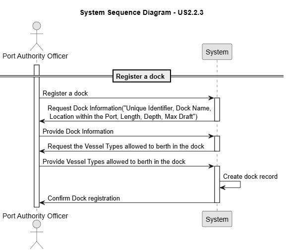
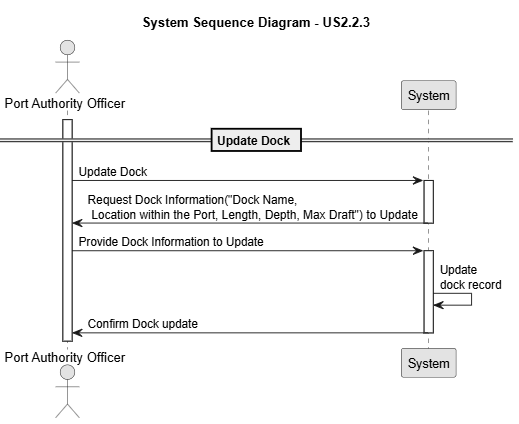
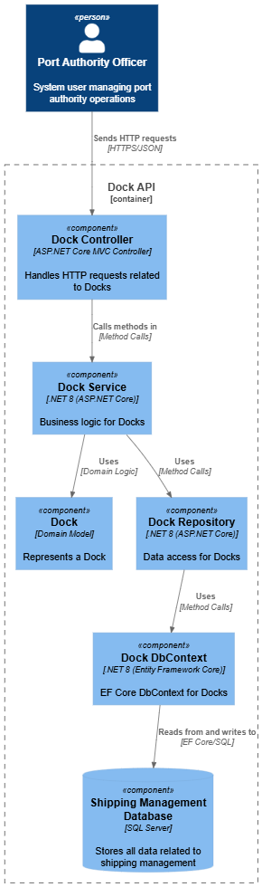
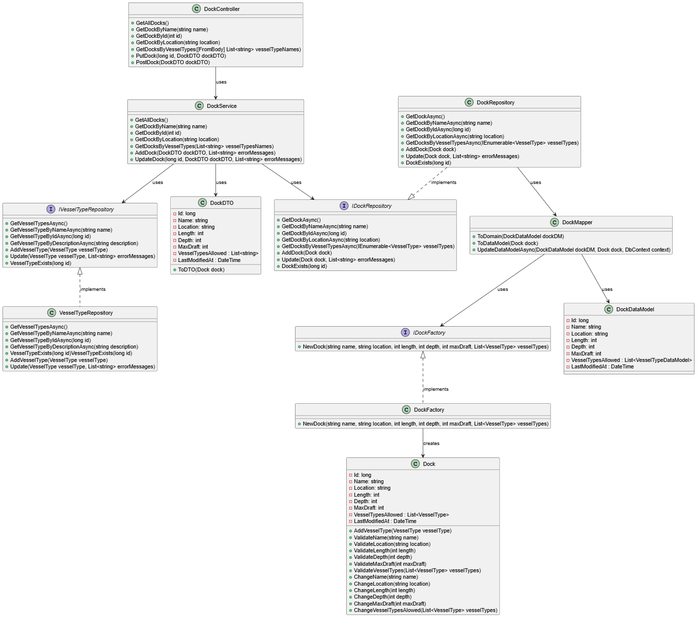
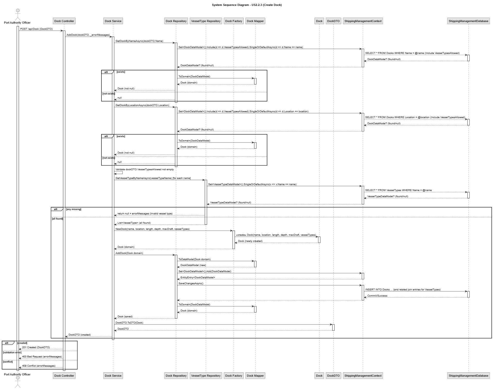
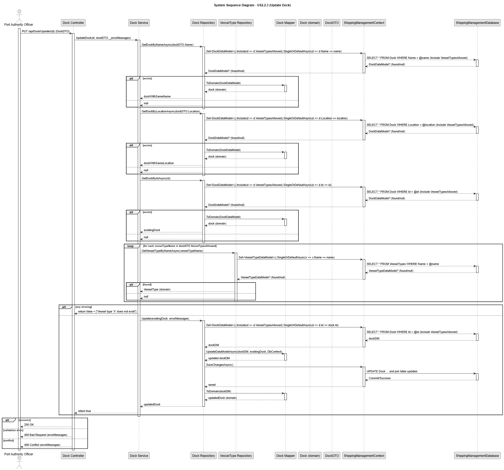

# US 2.2.3

## 1. Context

*Ports operate with multiple docks that accommodate vessels of different sizes and characteristics. To ensure proper port management, the system must allow the registration and update of dock information, including their identifiers, physical characteristics, and the vessel types they support.*

## 2. Requirements

**US 2.2.3** As a Port Authority Officer, I want to register and update docks, so that the system accurately reflects the docking capacity of the port.

**Acceptance Criteria:**

- A dock record must include a unique identifier, name/number, location within the port, and physical characteristics (e.g., length, depth, max draft).

- The officer must specify the vessel types allowed to berth there.

- Docks must be searchable and filterable by name, vessel type, and location.


**Dependencies/References:**

*There is a dependency with US2.2.1, since a vessel type must exist so it can be assigned on the record.*

**Forum Insight:**

>> Regarding this user story, can you confirm if a dock supports only one vessel type?
> 
> No! That is clearly wrong. An acceptance criteria states that "The officer must specify the vessel types allowed to berth there.". On a given dock may berth several vessel types (e.g. Feeder and Panamax).

>> Regarding the user story for registering and updating a dock, we are not sure what is meant by "location within the port." Should this be stored as geographic coordinates, or as a relative/semantic position (e.g., area, zone) within the port?
>
> In this case, you may consider the "location within the port" as a free text.

>> Following up on the previous response, I would like to clarify whether the system should prevent creating or editing a dock at the same location as an existing one, in other words, can two docks share the same location?
>
> In practice, they cannot... But, as I said before, treat this information as free text.

>> Is there any relation between MaxDraft and Depth of dock that the system should validate?
>
> Yes, there is a relation between both. But, you may ignore it, by now... Currently, we are checking the ability to a vessel berth on a given dock by the relationship between the target dock and the vessel type.

>> Are docks considered Storage Areas also ? Or we assume that Storage Areas are only the yards and warehouses ? 
>
> Docks are not storage areas. Right.

>> Which fields of a dock are allowed to be updated once it is registered?
>
> All excepting the id.

>> Should the system maintain a log of dock updates, recording who made the changes and when?
>
> Yes, for compliance with the statement "All user interactions must be carefully logged, producing detailed records of every significant action performed in the system. These logs are not only essential for auditing and traceability but also serve as an important tool for diagnosing issues and analyzing user behavior." (cf. System Description document, section 3.3)

## 3. Analysis

Register Dock



Update Dock




## 4. C4 Model


#### Components - Level 3



#### Code - Level 4



### Model4+1

Register Dock



Update Dock




## 5. Tests

### Tests Related To Put

```
    [Theory]
    [InlineData("Dock Teste", "New Location", 600, 35, 18, new[] { "Teste1", "Teste2" })]
    [InlineData("Dock Teste 2", "New Location 2", 700, 40, 20, new[] { "Teste1" })]
    [InlineData("Dock Teste 3", "New Location 3", 800, 50, 25, new[] { "Teste2","Teste3" })]
    public async Task PutDock_UpdatesSuccessfully(string name, string location, int length,int depth, int maxDraft, string[] vesselTypeNames)
    {

        var response = await _client.GetAsync("/api/Dock/ByName/Dock A");
        Assert.Equal(HttpStatusCode.OK, response.StatusCode);
        var dock = await response.Content.ReadFromJsonAsync<DockDTO>();
        Assert.NotNull(dock);

        dock.Name = name;
        dock.Location = location;
        dock.Length = length;
        dock.Depth = depth;
        dock.MaxDraft = maxDraft;
        dock.VesselTypesAllowed = vesselTypeNames.ToList();

        var putResponse = await _client.PutAsJsonAsync($"/api/Dock/Update/{dock.Id}", dock);
        Assert.Equal(HttpStatusCode.OK, putResponse.StatusCode);

        var getResponse = await _client.GetAsync($"/api/Dock/ById/{dock.Id}");
        if (getResponse.StatusCode != HttpStatusCode.OK)
        {
            var errorContent = await getResponse.Content.ReadAsStringAsync();
            throw new Xunit.Sdk.XunitException($"Expected OK but got {getResponse.StatusCode}. Response content: {errorContent}");
        }
        var returned = await getResponse.Content.ReadFromJsonAsync<DockDTO>();
        Assert.NotNull(returned);
        Assert.Equal(name, returned.Name);
        Assert.Equal(location, returned.Location);
        Assert.Equal(length, returned.Length);
        Assert.Equal(depth, returned.Depth);
        Assert.Equal(maxDraft, returned.MaxDraft);
        Assert.Equal(vesselTypeNames.Length, returned.VesselTypesAllowed?.Count);
    }

```


```
    [Theory]
    [InlineData("Dock A", "Port 2")]
    [InlineData("Dock B", "Port 1")]
    public async Task PutDock_DuplicateLocation_ReturnsConflict(string name, string location)
    {
        var response = await _client.GetAsync($"/api/Dock/ByName/{name}");
        Assert.Equal(HttpStatusCode.OK, response.StatusCode);
        var dock = await response.Content.ReadFromJsonAsync<DockDTO>();
        Assert.NotNull(dock);

        dock.Location = location;

        var putResponse = await _client.PutAsJsonAsync($"/api/Dock/Update/{dock.Id}", dock);
        Assert.Equal(HttpStatusCode.Conflict, putResponse.StatusCode);
    }

    [Fact]
    public async Task PutDock_DuplicateName_ReturnsConflict()
    {
        var response = await _client.GetAsync($"/api/Dock/ByName/Dock A");
        Assert.Equal(HttpStatusCode.OK, response.StatusCode);
        var dock = await response.Content.ReadFromJsonAsync<DockDTO>();
        Assert.NotNull(dock);
        dock.Name = "Dock B";
        var putResponse = await _client.PutAsJsonAsync($"/api/Dock/Update/{dock.Id}", dock);
        Assert.Equal(HttpStatusCode.Conflict, putResponse.StatusCode);
    }

```

### Tests Related To Post

```
    [Theory]
    [InlineData("Dock C", "Location A", 100, 50, 25, new[] { "Teste1", "Teste2" })]
    [InlineData("Dock D", "Location B", 200, 60, 30, new[] { "Teste3" })]
    [InlineData("Dock E", "Location C", 300, 70, 35, new[] { "Teste1", "Teste3", "Teste2" })]
    public async Task PostDock_ThenGetByName_ReturnsCreatedAndOk(string name, string location, int length, int depth, int maxDraft, string[] vesselTypeNames)
    {
        var newDock = new DockDTO
        {
            Name = name,
            Location = location,
            Length = length,
            Depth = depth,
            MaxDraft = maxDraft,
            VesselTypesAllowed = vesselTypeNames.ToList()
        };

        var postResponse = await _client.PostAsJsonAsync("/api/Dock", newDock);
        Assert.Equal(HttpStatusCode.Created, postResponse.StatusCode);

        var getResponse = await _client.GetAsync($"/api/Dock/ByName/{name}");
        Assert.Equal(HttpStatusCode.OK, getResponse.StatusCode);

        var returnedDock = await getResponse.Content.ReadFromJsonAsync<DockDTO>();
        Assert.NotNull(returnedDock);
        Assert.Equal(name, returnedDock.Name);
        Assert.Equal(location, returnedDock.Location);
        Assert.Equal(length, returnedDock.Length);
        Assert.Equal(depth, returnedDock.Depth);
        Assert.Equal(maxDraft, returnedDock.MaxDraft);
        Assert.Equal(vesselTypeNames.Length, returnedDock.VesselTypesAllowed?.Count);
    }

```


```
    [Theory]
    [InlineData("Dock A", "Unique Location", 100, 50, 25, new[] { "Teste1", "Teste2" })]
    [InlineData("Dock B", "Another Unique Location", 200, 60, 30, new[] { "Teste3" })]
    public async Task PostDock_DuplicateName_ReturnsConflict(string name, string location, int length, int depth, int maxDraft, string[] vesselTypeNames)
    {
        var newDock = new DockDTO
        {
            Name = name,
            Location = location,
            Length = length,
            Depth = depth,
            MaxDraft = maxDraft,
            VesselTypesAllowed = vesselTypeNames.ToList()
        };

        var postResponse = await _client.PostAsJsonAsync("/api/Dock", newDock);
        Assert.Equal(HttpStatusCode.Conflict, postResponse.StatusCode);
    }


    [Theory]
    [InlineData("Unique Dock", "Port 1", 100, 50, 25, new[] { "Teste1", "Teste2" })]
    [InlineData("Another Unique Dock", "Port 2", 200, 60, 30, new[] { "Teste3" })]
    public async Task PostDock_DuplicateLocation_ReturnsConflict(string name, string location, int length, int depth, int maxDraft, string[] vesselTypeNames)
    {
        var newDock = new DockDTO
        {
            Name = name,
            Location = location,
            Length = length,
            Depth = depth,
            MaxDraft = maxDraft,
            VesselTypesAllowed = vesselTypeNames.ToList()
        };

        var postResponse = await _client.PostAsJsonAsync("/api/Dock", newDock);
        Assert.Equal(HttpStatusCode.Conflict, postResponse.StatusCode);
    }

```


```
    [Theory]
    [InlineData("", "Location A", 100, 50, 25, new[] { "Teste1", "Teste2" })] // Empty name
    [InlineData("   ", "Location B", 200, 60, 30, new[] { "Teste3" })] // Whitespace name
    [InlineData(null, "Location C", 300, 70, 35, new[] { "Teste1", "Teste3", "Teste2" })] // null name
    [InlineData("Valid Name", "", 300, 70, 35, new[] { "Teste1" })] // Empty location
    [InlineData("Valid Name 2", "   ", 400, 80, 40, new[] { "Teste2" })] // Whitespace location
    [InlineData("Valid Name 3", null, 500, 90, 45, new[] { "Teste3" })] // null location
    [InlineData("Valid Name 4", "Valid Location", -100, 100, 50, new[] { "Teste1" })] // Negative length
    [InlineData("Valid Name 5", "Valid Location 2", 600, -10, 60, new[] { "Teste2" })] // Negative depth
    [InlineData("Valid Name 6", "Valid Location 3", 700, 110, -20, new[] { "Teste3" })] // Negative max draft
    [InlineData("Valid Name 7", "Valid Location 4", 800, 120, 70, new string[] { })] // Empty vessel types
    [InlineData("Valid Name 8", "Valid Location 5", 900, 130, 80, new[] { "NonExistentType" })] // Non-existent vessel type
    public async Task PostDock_InvalidData_ReturnsBadRequest(string? name, string? location, int length, int depth, int maxDraft, string[] vesselTypeNames)
    {
        var newDock = new DockDTO
        {
            Name = name,
            Location = location,
            Length = length,
            Depth = depth,
            MaxDraft = maxDraft,
            VesselTypesAllowed = vesselTypeNames.ToList()
        };

        var postResponse = await _client.PostAsJsonAsync("/api/Dock", newDock);
        Assert.Equal(HttpStatusCode.BadRequest, postResponse.StatusCode);
    }

```
