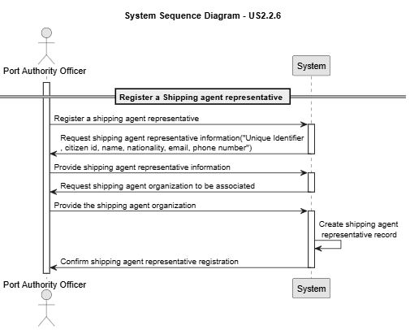

# US 2.2.6

## 1. Context

*Representatives are the official contacts and decision-makers acting on behalf of shipping agent organizations within the port’s digital system. Their registration and management are crucial to ensure that only authorized individuals can interact with the system and receive notifications related to operations and approvals.*

## 2. Requirements

**US 2.2.6** As a Port Authority Officer, I want to register and manage representatives of a shipping agent organization (create, update, deactivate), so that the right individuals are authorized to interact with the system on behalf of their
organization.

**Acceptance Criteria:**

- Each representative must be associated with exactly one shipping agent organization.

- Required representative details include name, citizen ID, nationality, email, and phone number.

**Dependencies/References:**

*There is a dependency with US2.2.5, since a shipping agent organization must exist so it can be assigned on the record.*

**Forum Insight:**

Still no questions asked about the US'S.

## 3. Analysis

Record Registration

