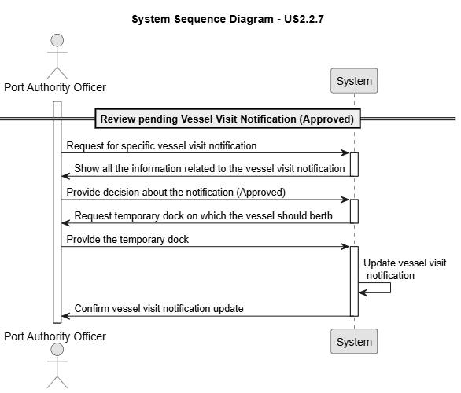

# US 2.2.8

## 1. Context

*Shipping agents are organizations that represent vessel owners or operators in port operations. Their primary responsibility is to coordinate administrative and operational tasks associated with a vessel visit, including submitting Vessel Visit notifications and providing cargo information in compliance with port regulations. Each shipping agent organization may have multiple representatives authorized to interact with the system on its behalf.*

## 2. Requirements

**US 2.2.8** As a Shipping Agent Representative, I want to create/submit a Vessel Visit Notification, so that the vessel berthing and subsequent (un)loading operations at the port are scheduled and planned in space and timely manner.

**Acceptance Criteria:**

- The Cargo Manifest data for unloading and/or loading is included.

- The system must validate that referred containers identifiers comply with the ISO 6346:2022 standard.

- Information about the crew (name, citizen id, nationality) might be requested, when necessary, for compliance with security protocols.

- Vessel Visit Notifications might become at an "in progress" status (e.g. cargo information is incomplete) to be further update/completed.

- When completed / ready for asking approval, the agent is required to change its state to "submitted".

**Dependencies/References:**

*There is a dependency with US2.2.2, since a vessel must exist so the vessel visit notification can be created.* 
*There is a dependency with US2.2.6, since a shipping agent representative must exist to perform the creation/submit of a vessel visit notification.*

**Forum Insight:**

>> In the assignment, it is stated that, for most visits, the crew information to be stored is limited to the captain's name and the number of crewmates, and that, should the vessel carry hazardous or dangerous cargo, that it should also include information regarding safety officers on board.
Is this all the necessary crew information? Do we need additional crew information of anyone who isn't a safety officer?
>
> Yes! By now, no need for more crew information than that.

>> Boa tarde, 
Reparei que na US 2.2.8 refere, no acceptance criteria, que informação pode ser adicionada no futuro. Apenas deu o exemplo de adicionar informação da carga.
Informação de tripulantes ou outros dados podem ser alterados ou adicionados mais tarde? Ou apenas certas informações podem ser adicionadas/alteradas.
Cumprimentos,
>
> Enquanto o estado do Vessel Visit Notification for "in progress" (US 2.2.8 e US 2.2.9) todos os seus dados podem ser alterados/adicionados.
Depois de ser submetido, já não pode ser alterado pelo Shipping Agent Representative.

## 3. Analysis

Review and Approved 

Review and Rejected

