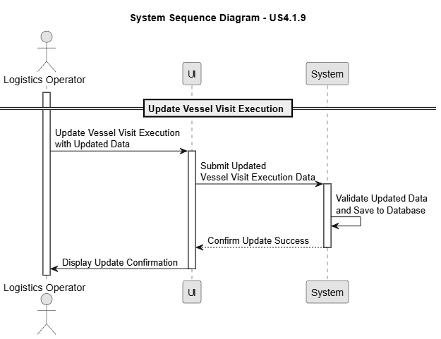

# US 4.1.9

## 1. Context

*This user story addresses the need to accurately reflect real-time operational execution by allowing Logistics Operators to update an in-progress Vessel Visit Execution (VVE). Building on previously created executions (US4.1.7), the system enables operators to record executed operations derived from planned ones, ensuring ease of use and consistency.*

## 2. Requirements

**US 4.1.9** As a Logistics Operator, I want to update an in progress VVE with executed operations, so that the system reflects real execution progress and performance.

**Acceptance Criteria:**

- Executed operations (mainly) derive from planned operations, which may be used to easy recording execution of operations. 

- The SPA must allow the operator to confirm or modify start/end times and resource usage.

- The corresponding planned operations must be marked as “started,” “completed,” or “delayed.”

- Execution updates must be stored with timestamps and operator ID.

- Completion status must synchronize with the corresponding Operation Plan for comparison.

**Dependencies/References:**

*This user story depends on US4.1.7 because to be able to update Vessel Visit Executions, they already must be created.*

**Forum Insight:**

>> Queríamos confirmar se os conceitos de VVE e Operation Plan estão interligados através do VVN. Isto é, como na User Story 4.1.9 é dito que é possível atualizar VVEs com operações executadas — operações estas que vêm do Operation Plan — e, na User Story 4.1.7, para criar um VVE, este tem como referência um VVN, gostaríamos de perceber se o VVE conhece diretamente o Operation Plan devido ao que é descrito na US 4.1.9 ou se essa ligação é feita indiretamente através do VVN.
> 
> Parece-me que o que está em causa é mais um questão técnica...
Contudo, uma VVE é sempre relativa a uma VVN. O plano de operações dessa VVE é o que está estabelecido para a respetiva VVN (cf. sugerido na US 4.1.9).
Nota, contudo, que a informação relativa à execução de operações pode ser distinta da planeada.
Por exemplo, a descarga do contentor X pode estar planeada para se iniciar às13h52 e, na prática, apenas começar às 14h01.
Ou seja, neste exemplo, haveria um atraso de 9 minutos na realização dessa operação.

>> Bom dia, na US 4.1.9 diz "The corresponding planned operations must be marked as “started,” “completed,” or “delayed.”" mas este status não poderia ser parte das executed operations, sendo que assim que começam seria registada a sua hora de início e teriam o status "started"?
>
> Sim, as operações executadas também podem ter um estado.
Por exemplo, "started", "completed", "suspended" (e.g. devido a um incidente em curso).

>> "Execution updates must be stored with timestamps and operator ID." Os timestamps devem ser guardados para cada atualização das operações dos vessel visit executions ou a data da última atualização é suficiente? Além disso, o ID do logistics operator que é guardado pode ser o email do mesmo?
>
> É suficiente registar o timestamp e o ID de (i) quem criou/iniciou a execução da operação e (ii) de quem deu a execução da operação como concluída/completa.
O "ID" deve ser, de facto, o id do operador logistico... Se o "id" é o email, ok! Se não é, então não deveria ser o email...
Já agora, à luz de conformidade com questões legais (e.g., RGPD) deveriam pensar até que ponto faz sentido os "ids" serem endereços de email... Quais as vantagens/desvantagens de tal decisão?

## 3. Analysis

Vessel Visit Execution Update

## 4. C4 Model

#### Components - Level 3

#### Code - Level 4

## 5. Tests

